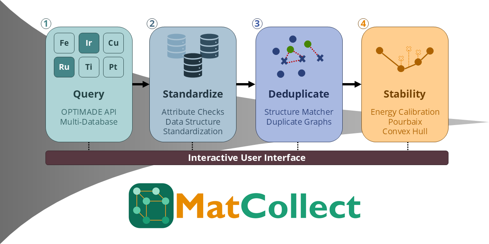

# MatCollect



MatCollect is a Streamlit application for collecting, analysing, and visualising materials science data. It connects to materials databases via the OPTIMADE API and the Materials Project, giving you a single interface for querying, cleaning, and evaluating thermodynamic stability across datasets.

**Try it now** — the app is available at [matcollect.example.com](https://matcollect.example.com).

## What MatCollect does

Working with materials databases typically means juggling multiple APIs, inconsistent data formats, and no easy way to compare entries across providers. Formation energies from different sources are not even directly comparable, since each database uses its own DFT settings and reference states. MatCollect brings the full workflow into one place:

- **Database search** — query any OPTIMADE-compliant provider or the Materials Project using a consistent interface, and export results in a unified format
- **Duplicate removal** — detect and remove duplicate entries across datasets using configurable similarity criteria, so your downstream analysis isn't skewed by redundant records
- **Cross-database energy calibration** — harmonise formation energies onto a single reference scale by fitting per-element offsets from structurally matched compounds, making data from different providers directly comparable
- **Stability analysis** — compute energy above hull and generate Pourbaix diagrams to evaluate thermodynamic and electrochemical stability of your materials

## Where to go next

New to MatCollect? Start here:

- [Installation](getting-started/installation.md) — set up MatCollect locally or in a container
- [Quickstart guide](getting-started/quickstart.md) — run your first end-to-end workflow in minutes

Working through a specific step:

- [Database search](guides/database-search.md) — query OPTIMADE providers and the Materials Project, then filter and inspect results
- [Duplicate removal](guides/duplicate-removal.md) — collapse the same structure appearing across multiple databases
- [Stability analysis](guides/stability-analysis.md) — calibrate energies, then evaluate energy above hull and Pourbaix stability

Looking up specifics of the code:

- [Reference](reference/index.md) — class-level documentation for the core modules

## License

MatCollect is released under the [MIT License](https://opensource.org/licenses/MIT).

## Citation

If you use MatCollect in your research, please cite the accompanying paper:

```bibtex
@article{matcollect,
  author  = {Last, First and Last, First},
  title   = {MatCollect: A tool for collecting, deduplicating, and analysing materials science data},
  journal = {Journal Name},
  year    = {2026},
  volume  = {},
  pages   = {},
  doi     = {}
}
```

You can also cite the specific software version used:

```bibtex
@software{matcollect_software,
  author  = {Last, First and Last, First},
  title   = {MatCollect},
  year    = {2026},
  url      = {https://github.com/your-org/matcollect},
  version = {1.0.0}
}
```
